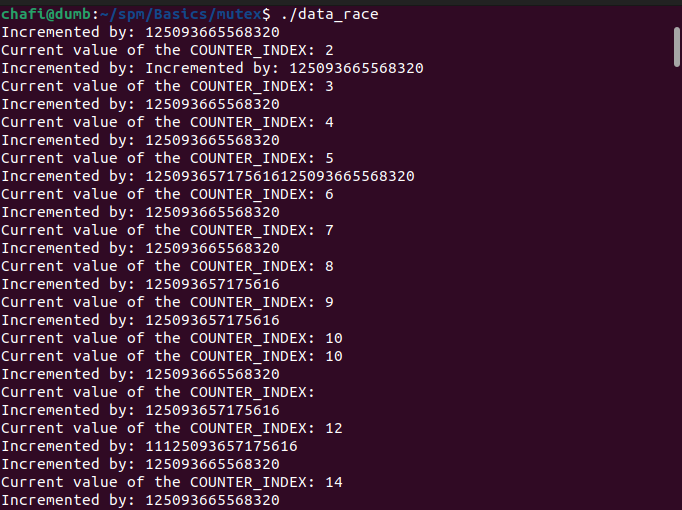
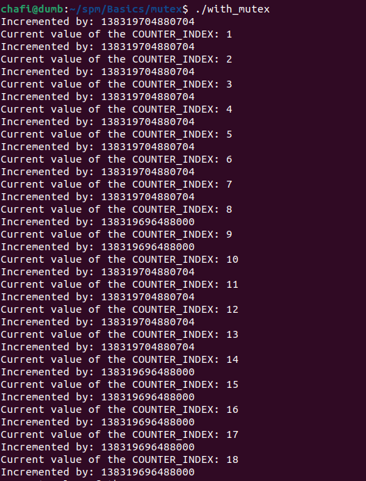

# Mutex?

When several threads share the same variable/state, date-race is being introduced. `Mutual Exclusion` ensures that the shared variable is accessed by one thread at a time. Once one thread is done executing, another will acquire the lock and write on it. If the state is being read-only there is no data-race, but when being written there is.

## Example of the data-race

## With `mutex`

