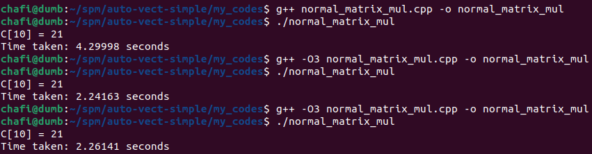

# Testing the not-vectorized.cpp file

I ran this command to auto-vectorize the code: g++ -O3 -march=native -ftree-vectorize     -fopt-info-vec-optimized=vec.txt not-vectorized.cpp; it generated a file vec.txt where we can see the lopps that the compiler vectorized automatically.

## About the not-vectorized.cpp

First I tried a simple program with vector data-types and pointers. We didn't use any pointer restriction or vectorizing. For reference see the [code base](./my_codes/normal_matrix_mul.cpp). The main intention is to see the difference between the professor's improvement of [vectorizing](/auto-vect-simple/not-vectorized.cpp) and my simple [code base](./my_codes/normal_matrix_mul.cpp).

## no `*__restrict__` pointer

By default when we declare two or more pointers the compiler doesn't deliberately know beforehead that they are not alisaes. The compiler is not sure that they will fight for same memory locations(references of each other).

## no `#pragma GCC ivdep`(ignore vector dependencies)

Although we used compiler optimization -O3 to compile our [code base](./my_codes/normal_matrix_mul.cpp). But we didn't use any directive to tell the compiler to vectorize the loops(the #pragma). So, it was automatic. It is mandatory to use -O3 to activate all the optimization by the compiler. `#pragma GCC ivdep` is just a declarative that says: yes there is no dependency, for sure you can go ahead with the vectorization. But if you use the -O3 tag, the compiler eventually figures that out.

## did we see any performance boost?

Even though it does impact the performance but in our case we didn't see much because our code was not that complex.

## testing the `one.cpp` file

> g++ -O3 -fopt-info-vec-missed one.cpp 2>&1   | grep -E "^one\.cpp:"

We have two loops in our [code](/auto-vect-simple/one.cpp):

- first loop simply initializes the array `int x[n]` that we decalred.
- second loop accumulates the value with `s`, where `s` is an integer initialized as 0. S

Simple loop with no dependency. So, out vectorization output was(we only checked the missing optimizations and in this case there was no loop missed):

## testing the `two_cpp.cpp` file

> g++ -O3 -fopt-info-vec-missed two.cpp 2>&1   | grep -E "^two\.cpp:"

We have two loops in our [code](/auto-vect-simple/two.cpp):

The output:

- the first loop is just initialization, so it is vectorized.
- the second loop has a read-after-write dependency in the same memory location `x[0~i]`. As we read in the theory(slide 07-SIMD on CPU), dependend loops cannot be vectorized automatically by the compiler. Here is where the programmer takes over and solves the issue.

## testing the `three_output.cpp` file

> g++ -O3 -fopt-info-vec-missed three.cpp 2>&1   | grep -E "^three\.cpp:"

We have two loops in our [code](/auto-vect-simple/three.cpp):

The output:

- the same situation here as well.
