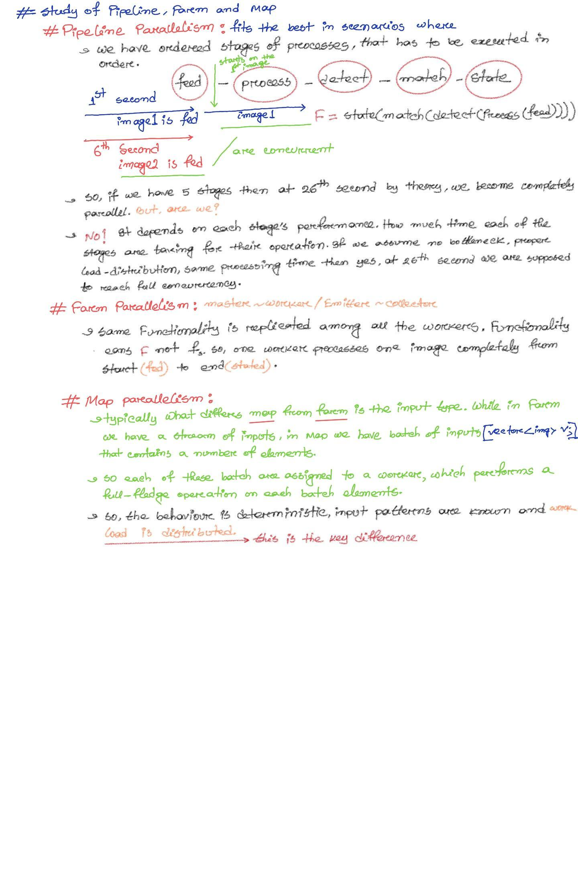

# This is just a private note based on my learning of Fastflow and Parallel Paradigms

The first discussion is on: key difference between three parallel model that are mainly discussed in fastflow. Three main parallel paradigms that are discussed: pipeline, farm and map. Here is a very little discussion on that:

Before fastflow some automatic parallelization examples are shown in [openmp-folder](../openmp/parallel-paradigms/).
