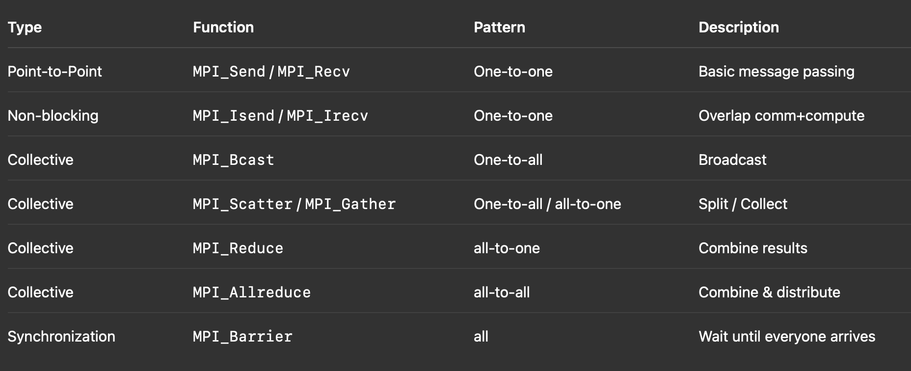
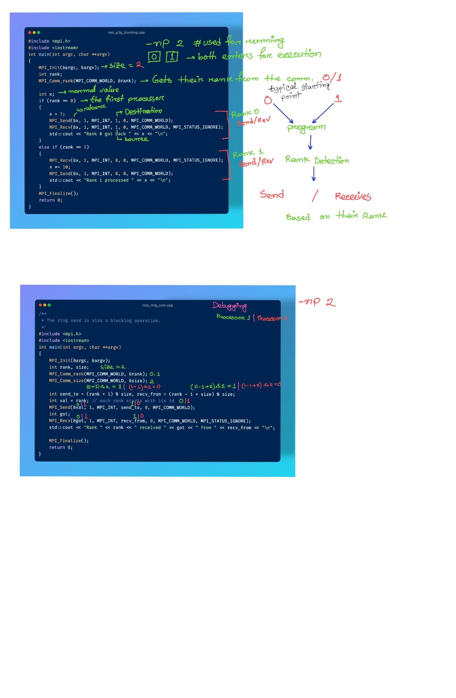

# About MPI

Is not a language but an Interface/Library that helps Processors from different machines/nodes communicating with each other. As we know every processor/cores has it's own memory (L1,L2 caches that are private) MPI enables communication between those memories in different machines.

If you are using advanced logging system, don't forget to compile your codes with appropriate flags. For more [please checkout this link](../commands.md#modern-logging-library)

## Installation

First install the required libraries:

```bash
sudo apt install openmpi-bin openmpi-common libopenmpi-dev
```

Look for the path:

```bash
mpic++ --showme:compile 
# /usr/lib/x86_64-linux-gnu/openmpi/include is the common path
```

Now add this path in vsCode `include_path` for referencing `mpi.h`.

## Programs and Compilations

There are several programs written here to demonstrate the working mechanism of `MPI`, so we will explain each of them one by one:

[mpi_hello](./mpi_hello.cpp)

```bash
mpicxx hello.cpp -o hello
mpirun -np 4 ./hello #put 2 later
```

This code in my machine with 4 CPU will not work and generate an issue regarding oversubscription. The moral is MPI works with physical cores not logical ones. My laptop had 2 physical cores so it supports `-np 2` only, but there are helpers like: `SLURM` which allows dynamic allocation.

## Legends

`rank` - is the current processor
`size` - is the total number of processor available for the task
`MPI_COMM_WORLD` - is the global communicator who makes a group of processors that can communicate with each other.
`MPI_Comm_rank` - call the default communicator and assigns the first processor to the `rank` variable.
`MPI_STATUS_IGNORE` - defines that the sender doesn't care about the status of the received message, just send it.
`MPI_Send & MPI_Recv` - are the functions that performs the send and the receive.

### Communication among/between processes

Two main functions for communication:

```cpp
MPI_Send(void* data, int count, MPI_Datatype type, int destination, int tag, MPI_Comm comm)

MPI_Recv(void* data, int count, MPI_Datatype type, int source, int tag, MPI_Comm comm, MPI_Status* status)

int MPI_Scatter(
    const void* sendbuf,   // data to send (valid only at root)
    int sendcount,         // number of elements sent to *each* process
    MPI_Datatype sendtype, // type of each element (e.g., MPI_INT)
    void* recvbuf,         // buffer where each process receives its data
    int recvcount,         // number of elements each process receives
    MPI_Datatype recvtype, // usually same as sendtype
    int root,              // rank of the sending process
    MPI_Comm comm          // communicator (e.g., MPI_COMM_WORLD)
);

int MPI_Gather(
    const void* sendbuf,   // local data to send
    int sendcount,         // elements sent by each process
    MPI_Datatype sendtype, // type of those elements
    void* recvbuf,         // buffer at root to collect everything
    int recvcount,         // elements expected from each process
    MPI_Datatype recvtype, // type of received elements
    int root,              // rank of collecting process
    MPI_Comm comm          // communicator
);
```

A short summary on communication types:



## Debugging examples of some codes


