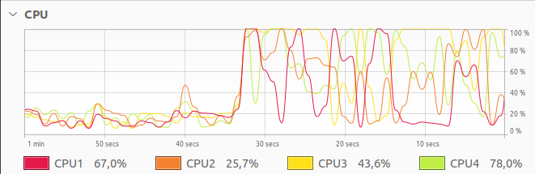
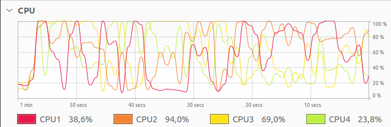
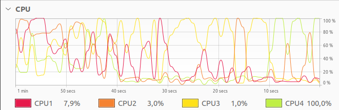

# Threads

Part of your code that you can run independently. I will share resources but still that part of the code is independent. For sharing resources we have several methods that we will see.

## Main thread

When we run our program the first stack created by the OS is the `main` thread. It is completely managed by the OS, but we can create/spawn `worker` threads inside the main thread and also inside `worker` threads.

```cpp
int main(){} // is the main thread the stack starts but spawned worker threads also have their own stack
```

## Worker thread

First we `include` the c++ library:

```cpp
#include<thread>
```

Then we spawn threads:

```cpp
thread t1(callable,param); //the execution starts immediately
```

Then we join to execute it:

```cpp
t1.join() //halts the main thread from executing anythin else
```

The joining also ensures that the main thread is blocked until the spawned threads are finished. You might get confused that if the `main` is blocked then how it's parallel? Doesn't it look like sequential?

Yes, but here the blocking is not blocking of the spawned threads but only the main thread to execute something else.

See this [example](./simple_thread.cpp) for a better undestanding.

## Later I did some CPU work intensive test to see how the threads behave if I try to utilize the whole CPU resource

We generated **4** threads because my machine has two physical cores and 4 logical ones. The first picture shows how two running threads are utilizing the 4 physical threads:




By the time 3 threads were finished executing and one was left:



The intention for this test was how OS handles our threads(we wrote in our code) with physical threads. In the last image we can see one CPU is 100% others are bare minimum. Now if one thread is running any of these 4 CPUs will be utilized by the OS. Which one? Depends which one the OS picks.

## How we should compile the threads containing programs?

> g++ -O3 -std=c++7 program.cpp -o program -pthread

## But what happens when you have to pass parameters to your thread functions?

This [program](./with_parameter.cpp) demonstrates how you can pass parameters in a thread function.
